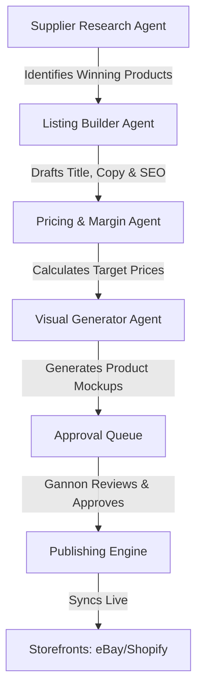

# GanozMix Direct — E-commerce & Dropshipping Agent Blueprint

This blueprint defines the architecture, operational guidelines, calculators, and multi-agent workflow for the GanozMix Direct e-commerce platform. It operates separately from the Gannon Waye Music brand, focusing on high-efficiency, automated product sourcing, listing building, margin optimization, and marketplace publishing.

---

## 1. Core Principles & Safety
* **Zero Direct Publishing:** All listings, price updates, and inventory changes generated by agents are queued in the **Approval Queue**. No agent may publish directly to eBay, Shopify, or other channels.
* **Capital Protection:** Agents must not place automated fulfillment orders with suppliers unless funds from the customer have been cleared and verified by the Stripe Revenue Protection Agent.
* **No Auto-Payment:** Supplier checkout must remain manual or gated by Gannon's payment approval tokens.

---

## 2. The GanozMix Direct E-commerce Agent Workflow

### Specialist E-commerce Agents:
1. **Sourcing & Supplier Intelligence Agent:** Scans AliExpress, CJ Dropshipping, and Amazon for high-volume, high-rating (4.7+) products.
2. **SEO & Listing Copywriter Agent:** Formulates highly descriptive, optimized titles and specifications.
3. **Pricing & Margin Optimizer Agent:** Calculates margins, dynamically adjusts for platform fees, taxes, and shipping rates.
4. **Visual Mockup Architect:** Uses AI generation tools to create custom product mockups and lifestyle scenes.
5. **Approval Gatekeeper Agent:** Consolidates drafts, flags warnings (e.g. low margins, trademark risks), and queues them for Gannon.

---

## 3. Product Research & Supplier Tracking
The Sourcing Agent evaluates products based on the following criteria:
* **Feedback Score:** Minimum 95% positive supplier feedback.
* **Shipping Time:** Target < 12 business days to Australia and USA.
* **Inventory Buffer:** Suppliers must hold at least 500+ items in stock. If stock drops below 50, the agent automatically disables the live listing or flags a warning.

---

## 4. Pricing & Margin Calculator
The Pricing Agent enforces the **Margin Calculator Formula**:

$$RetailPrice = \frac{(SupplierCost + ShippingCost) \times MarkupMultiplier + FixedFee}{1 - PlatformFeeRate}$$

### Formula Parameters:
* **Supplier Cost:** Base price of the product from AliExpress/CJ.
* **Shipping Cost:** Selected shipping tier cost (e.g. CJ Packet).
* **Markup Multiplier:** Default `1.5x` (low cost) or `1.3x` (high cost > $50).
* **Fixed Fee:** Buffer for packaging, returns, and transaction processing ($2.50 AUD).
* **Platform Fee Rate:** `0.15` (15% for eBay/Shopify payment fees).

### Margin Protection Rules:
* If Supplier Cost increases, the agent flags an immediate price-update task in the approval queue.
* If Margin drops below **15% net**, the listing is paused.

---

## 5. Shipping Rules & Logistics
The shipping matrix is configured dynamically:
* **Standard Shipping:** Maps to CJ Packet / ePacket. Delivery target 8–15 days. Cost dynamically passed to checkout.
* **Express Shipping:** Maps to DHL / FedEx. Delivery target 3–7 days. Flat fee markup of $15.00 AUD.
* **Free Shipping Threshold:** Triggered on orders above $75.00 AUD. The system absorbs the standard shipping cost into the product margin.

---

## 6. Listing Builder & SEO Optimizer
The Listing Agent generates listings with the following structure:
* **Optimized Title:** Under 80 characters, front-loaded with high-value search terms (e.g., `Brand + Model + Material + Size + Color`).
* **Heading Hierarchy:** Single `H1` matching product name, followed by `H2` for specifications and features.
* **Schema Markup:** Product schema containing Price, Availability, and Review fields dynamically updated.

---

## 7. Approval Queue & Publishing Workflow
1. **Draft Generation:** Agents assemble listing details, images, prices, and shipping rules.
2. **Sanity Check:** System verifies no forbidden brands or trademarked names are present.
3. **Queue Entry:** The draft is posted to `/admin/ganozmix` with a status of `pending_approval`.
4. **Human Review:** Gannon reviews the details on the master dashboard, clicks "Approve", and the product goes live.
5. **Inventory Sync:** The background scheduler runs every 2 hours to keep prices and stock levels in sync with the supplier.
